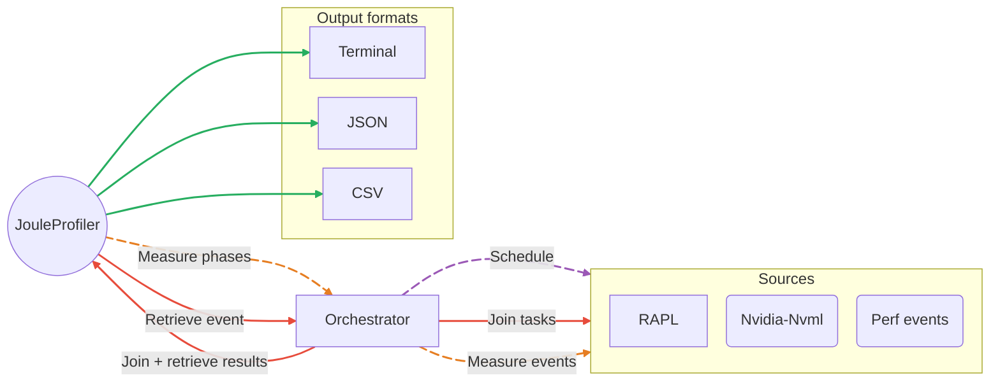

# Architecture

**Joule Profiler** is designed to minimize measurement overhead while maintaining high performance, modularity, extensibility, and a strong separation of concerns.

To achieve this, the project adopts a flexible domain-driven architecture centered around a core domain.

This architecture enables:

- Efficient asynchronous scheduling.
- Low-overhead metric collection.
- Easy integration of new metric sources.
- User-defined metric source extensions without modifying the core codebase.

## High-Level Design

At a high level, Joule Profiler is composed of three main layers:

- **CLI** – Responsible for user input, command line arguments parsing, and startup wiring.
- **Core Module** – Contains all domain logic: orchestration, aggregation, and result modeling.
- **Sources Module** – Implementations of the different metric sources using the API traits.

## Hexagonal Architecture

The core module represents the boundary of the domain.
All interactions with external systems, such as metric sources, go through abstract interfaces.

Key principles:

- Clear separation between what is measured and how it is measured, expressed through a common interface.
- No direct filesystem, OS, or hardware coupling.
- Interactions with external systems are uniform and decoupled from the core.
- We allow some dependencies like Tokio to be part of the core, because they provide essential asynchronous infrastructure, and moving them outside would unnecessarily complicate the core, which is not how we intend to design it.

This design allows the profiler to evolve independently of existing sources.

## Dynamic to Static Resolution

During startup, metric sources are handled dynamically to offer a clean interface and extensibility. But using dynamic traits would add a significant overhead on the tool due to dynamic dispatches depending on the number of sources used. We are resolving those sources statically using a wrapper trait with associated types before the measurements to avoid these dispatches and minimize the overhead.

This design enables:

- Heterogeneous metric sources within a single collection.
- Extensibility through plugins and user-defined sources.
- Independent configuration of each metric source.
- Low overhead compared to dynamically-typed sources.

## Source Orchestration

Each metric source runs in its own asynchronous task, allowing measurements to be performed concurrently.  
This design ensures that all sources can be sampled simultaneously while maintaining isolation and minimizing synchronization overhead.

## Event-Driven Control Flow

The profiler uses an event-driven model to control sources. Typical events include:

- Performing a measurement.
- Finalizing a phase or iteration.
- Terminating measurement and collecting results.

This allows sources to remain decoupled from orchestration logic while providing deterministic control over profiling.

## Iterations and Phases Tracking

Measurements are grouped into phases, and phases are grouped into iterations.
This incremental accumulation allows the profiler to report both detailed and aggregated results while maintaining low overhead.

## Asynchronous Scheduling

Some metric sources, such as RAPL, may perform internal asynchronous sampling to collect measurements at precise intervals.
This polling logic is fully encapsulated within the source, keeping the core completely agnostic to how measurements are gathered.

Sources that implement internal asynchronous sampling rely on an asynchronous runtime (e.g., Tokio) to schedule tasks efficiently.
This ensures that such sources remain highly performant and precise, without introducing additional complexity or overhead to the core orchestration.

Sources that do not require asynchronous sampling integrate seamlessly into the measurement loop, incurring only minimal overhead.

This design allows both time-based and event-driven sampling strategies, while keeping the core logic simple, isolated, and deterministic.

## Post-Measurement Processing

The API has been intentionally designed so that all calculations and data transformations occur after the measurement phase has completed, rather than during measurement, which would have increased the profiler overhead.

This design ensures that:

- Measurement overhead remains minimal and predictable.
- Raw data is collected in its most accurate form.
- All aggregations, conversions, and analyses are performed only once measurements are finalized.
- Users can rely on consistent, reproducible results without interference from real-time processing.

By separating data collection from post-processing, the profiler maximizes accuracy while maintaining flexibility for different types of analyses and reporting.

## Result Collection

When a profiling session completes, the orchestrator signals all sources to finalize their measurements.
Each source then returns its collected data, which is aggregated into a single unified view.

This approach allows sources to be reused across multiple profiling runs without reinitialization, while ensuring that all results are consistent and complete.

## Error Handling and Failure Propagation

The profiler follows a fail-fast model:

- Currently, most errors are detected during the initialization phase of each source.
- If an error occurs, the orchestrator halts further processing and the session is terminated, reporting the failure clearly.
- Full error detection during ongoing measurement is not yet implemented but will be added in a future update.

This design prioritizes correctness and data integrity over partial measurements, ensuring that the profiler does not produce incomplete or inconsistent results, even though some runtime errors are not yet captured until the end of the measurements.

---

## Design Summary

This architecture offers:

- Isolation of each metric source in its own task, ensuring independent and concurrent measurement.
- Event-driven control that is deterministic and predictable.
- Minimal overhead during measurement, with no dynamic dispatch in the critical path.
- Internal logic of each source is fully encapsulated, keeping implementation details hidden from the core.
- Strong fault isolation and graceful termination of sessions.

Overall, the profiler is extensible, flexible, and efficient, allowing new sources to be added seamlessly while preserving accurate and consistent performance characteristics.