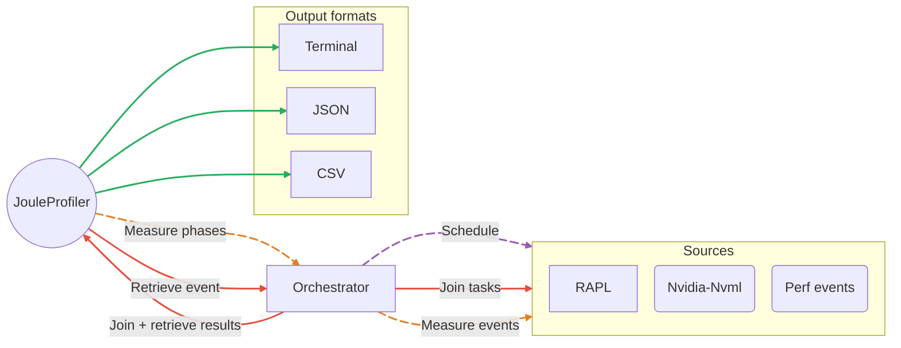

# Overview

**Joule Profiler** is designed to minimize measurement overhead while maintaining high performance, modularity, extensibility, and a strong separation of concerns.

This architecture enables:

- Efficient asynchronous scheduling.
- Low-overhead metric collection.
- Easy integration of new metric sources.
- User-defined metric source extensions without modifying the core.

## High-Level Design

At a high level, Joule Profiler is composed of three main layers:

- [**Core Module**](core-module.md) – Contains all domain logic: orchestration, aggregation, and result modeling.
- [**CLI Module**](cli-module.md) – Responsible for user input, command line arguments parsing, and startup wiring.
- [**Sources Workspace**](sources-workspace.md) – Implementations of the different metric sources using the API traits.