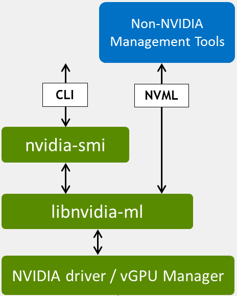

# NVIDIA Management Library (NVML)

## Overview

The NVIDIA Management Library is a C-based programmatic interface for monitoring and managing Nvidia GPUs. The library is available on Linux and Windows.
We're using the nvml-wrapper[^nvml-wrapper] rust crate to call the interface.

## Architecture

NVML (called also libnvidia-ml on Linux or nvml.dll on Windows) communicates directly to the Nvidia GPU driver and is the underlying library behind the nvidia-smi[^nvidia-smi] tool.

It reports various metrics and information:
- Static information including board serial number, PCI devices ids, product names and etc.
- Current utilization rates for both the compute resources of the GPU and the memory interface.
- Error correction counters for both the current boot cycle and for the lifetime of the GPU.
- The current core GPU temperature, along with fan speeds for non-passive products.
- For supported products, the current board power draw and power limits.
- The list of active processes running on the GPU is reported, along with the corresponding process name/id and allocated GPU memory.
- Max and current clock rates for several clock domains, as well as the current GPU performance state.

It provides also functions to enable / disable and reset ECC counters, change the compute mode and the persistence mode.

Nvidia GPUs energy consumption is available since Volta architecture. We query the driver through the library and obtain the GPU(s) energy consumption in mJ (millijoules) to address programs energy consumption.

## Overflow handling ?

NVML energy counters are expressed in millijoules on eight bytes. This unit allows energy to be measured over a very long period without considering an overflow; although one can theoretically occur, the period required makes it impossible in practice. For example, on a GPU consuming approximately 300 W:

$$ P = 300~\text{W} = 300~\text{J/s} = 3.0 \times 10^5~\text{mJ/s} $$

$$ t_\text{overflow} = \frac{E_\text{max}}{P} = \frac{2^{64}~\text{mJ}}{3.0 \times 10^5~\text{mJ/s}} \simeq 6.1 \times 10^{13}~\text{s} \simeq 1.9 \times 10^6~\text{years} $$

Consequently, overflow of the NVML energy counter can be safely ignored for any realistic measurement duration; it is sufficient to wrap subtractions in the unlikely event that an overflow occurs.

[^nvidia-smi]: [System Management Interface SMI (nvidia-smi)](https://developer.nvidia.com/system-management-interface)
[^nvml-wrapper]: [nvml-wrapper](https://github.com/rust-nvml/nvml-wrapper)