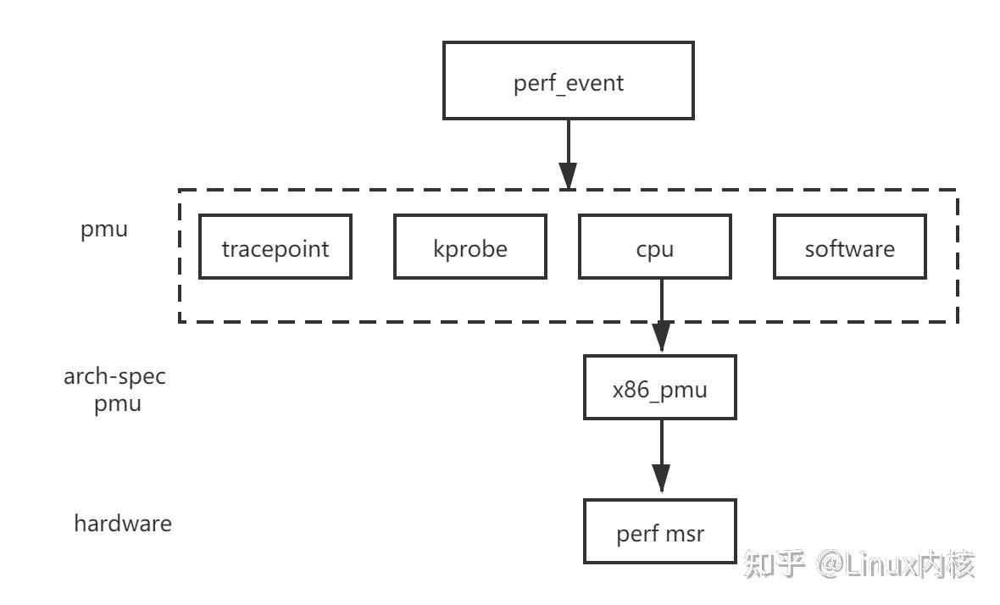

# perf_event

## Overview

**perf_event** is the Linux kernel’s performance monitoring API that provides access to hardware, software and other like PMU supported counters.

It allows fine-grained measurement of low-level events such as CPU cycles, instructions retired, cache misses, branch mispredictions, context switches, PMU supported counters and more. These events can be used to analyze performance bottlenecks, execution efficiency, and in combination with hardware counters it can be used to help estimating energy and power-related insights.

The `perf_event` subsystem has been part of the Linux kernel since version **2.6.31** and is supported on most modern architectures, including x86, ARM, and RISC-V.

## Architecture

The **perf_event** interface exposes a unified abstraction over multiple types of performance events. Events are collected by the kernel and accessed through the `perf_event_open` system call, which enables user-space tools to configure, start, stop, and read counters.

Events are collected per execution context and can be attached to:
- A specific **process**
- A specific **CPU**
- A **control group (cgroup)**

### Event Types

`perf_event` supports several categories of events:

| Event Type | Description |
|------------|------------|
| **Hardware** | CPU-provided events such as cycles, instructions, cache references, and cache misses. |
| **Software** | Kernel-provided counters such as context switches, page faults, and CPU migrations. |
| **Hardware Cache** | Cache-specific events broken down by cache level, operation, and result. |
| **Tracepoint** | Kernel tracepoints for observing system-level behavior. |
| **Raw** | Architecture-specific events accessed via raw event codes. |
| **PMU-specific** | Events exposed by hardware-specific Performance Monitoring Unit (PMU) like RAPL counters |

perf_event [event types](https://zhuanlan.zhihu.com/p/572533736):

> [!NOTE]
> - The availability and accuracy of events depend on the underlying hardware PMU and kernel configuration.
> - Access to certain events may require elevated privileges or relaxed kernel settings, see [perf_event_paranoid](perf_event_paranoid.md).

### Scopes

Events can be measured at different execution scopes:

| Scope | Description |
|------|------------|
| **Per-thread** | Counts events generated by a single thread. |
| **Per-process** | Aggregates events across all threads of a process. |
| **Per-CPU** | Counts events occurring on a specific CPU core. |
| **System-wide** | Aggregates events across all the system. |

This flexibility enables both micro-level profiling (single function or thread) and macro-level analysis (whole system behavior).

> [!IMPORTANT]
> - Some events like RAPL counters cannot be scoped and are by design system-wide counters.