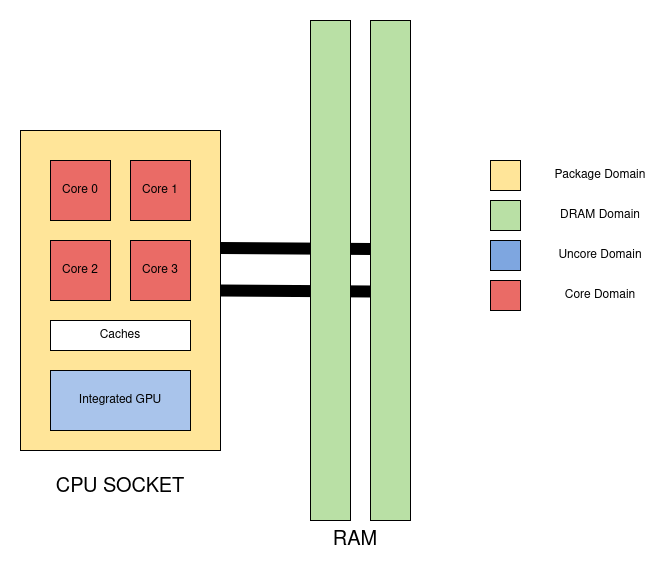

# Intel RAPL

## Overview

Intel RAPL (Running Average Power Limit) is an Intel processor feature that allows real-time measurements of CPU and memory energy consumption.

This technology has been available on Intel processors since *Sandy Bridge* generation.

RAPL provides energy measurements at different scales, enabling you to measure energy consumption per component and understand more precisely how each part of the system contributes to the overall power usage.

It allows fine-grained energy profiling of CPU cores, memory, and uncore components.

## Architecture

Intel RAPL interface exposes multiple power domains that allow measuring energy consumption of different parts of the processor and memory subsystem.

| Domain | Description |
|--------|------------|
| **Package** | Measures the total energy consumption of the entire CPU socket. This includes cores and uncore components. |
| **Core/PP0** | Represents the CPU cores only. Useful for profiling per-core energy consumption. |
| **Uncore/PP1** | Covers the energy consumption of last-level caches, memory controller, and may include the integrated GPU depending on the CPU generation. |
| **DRAM** | Measures the energy consumption of dynamic random access memory attached to the integrated memory controller if supported. |

It uses model-specific registers (MSRs) on the host system, which software can reas to monitor power usage in real time.

## Powercap

## Limitations

- entire system energy usage (not per-process)
- DRAM or iGPU not available depending on CPU generation
- 15 µJ for PP0 d'après ce que j'ai lu: short lived events or small energy changes may not be captured due to the limited resolution of hardware counters => not precise on short-lived and quick workloads