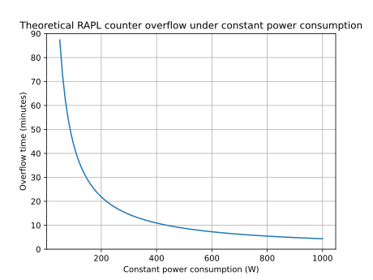

# Powercap

## Overview

Powercap[^powercap] is a Linux kernel framework that provides a generic and standardized interface for power capping and energy monitoring accross different hardware power domains.

Instead of accessing low-level hardware registers (e.g MSRs), Powercap safely exposes energy metrics via sysfs. 

The use of powercap instead of MSRs may seem disadvantageous and cause more overhead while measuring energy consumption, but there is actually no or an insignificant overhead introduced by the use of the powercap framework. Moreover, the abstraction provided by powercap increases the maintainibility, and powercap smoothens the energy results to avoid noise.

## Sysfs File Structure

The Powercap framework exports energy data through the `/sys/devices/virtual/powercap` or `/sys/class/powercap` directories. Each physical CPU socket or hardware component is represented as a **control type** (usually `intel-rapl`).

Within `intel-rapl`, the hierarchy is organized by **zones** and **subzones**, which correspond to the RAPL domains (Package, Core, DRAM, etc.).

The structure typically looks like this:

```text
/sys/devices/virtual/powercap
└── intel-rapl/
    ├── intel-rapl:0/                # Package 0 (CPU Socket 0)
    │   ├── name                     # Content: "package-0"
    │   ├── energy_uj                # Cumulative energy in microjoules
    │   ├── max_energy_range_uj      # Overflow value for the counter
    │   ├── intel-rapl:0:0/          # Subzone: Core (PP0)
    │   │   ├── name                 # Content: "core"
    │   │   └── energy_uj
    │   ├── intel-rapl:0:1/          # Subzone: DRAM
    │   │   ├── name                 # Content: "dram"
    │   │   └── energy_uj
    │   └── intel-rapl:0:2/          # Subzone: Uncore (PP1)
    │       ├── name                 # Content: "uncore"
    │       └── energy_uj
    └── intel-rapl:1/                # Package 1 (CPU Socket 1, if multi-socket)
```

To retrieve the domains measure energy consumption, the following files are accessed:

* **`name`**: The name of the corresponding domain (Package, Core, Uncore, DRAM or Psys).
* **`energy_uj`**: This is the core metric. It provides the current energy consumption in microjoules (µj).
* **`max_energy_range_uj`**: This file gives the maximum value before the counter wraps back to zero.

## Overflow Handling

Because the RAPL energy counters are stored in hardware with four bytes of information, they will eventually reach their maximum value and **wrap around** (overflow) back to zero.

The `max_energy_range_uj` file to indicate this threshold. To ensure accurate measurements, especially for long-running benchmarks, the monitoring tool must implement a robust overflow detection and correction logic.

To handle these overflows, the measurement worker thread performs **frequent polling** of the `energy_uj` files. By sampling the counters at a rate significantly higher than the theoretical minimum time it takes for a counter to wrap around, we can safely detect an overflow and correct it. The polling rate must be higher than the minimal period of an overflow, otherwise, an overflow could not be always detected.
In the future, we might implement an adaptive overflow period to minimize polling and reduce the overhead it introduces, even so it is negligible under hundreds of hertz.

The period of an overflow will depend mostly on the CPU wattage, but also on the domain, the DRAM package will not overflow often, while the psys or package domains might overflow in several minutes during high power consuming workload.

Theoretically, for a processor with a consumption of 200 W and a `max_energy_range_uj` of `262143328850` (common domain max_energy_range_uj), the **package** domain which represents the entire CPU consumption will overflow in around 22 minutes with a constant consumption.

Here is a graphic of the theoretical overflow time depending on the CPU wattage:



| Power (W) | Overflow time (min,sec) |
|-----------|------------------------|
| 100 | 43,41 |
| 200 | 21,50 |
| 300 | 14,33 |
| 400 | 10,55 |
| 500 | 8,44 |
| 600 | 7,16 |
| 700 | 6,14 |
| 800 | 5,27 |
| 900 | 4,51 |
| 1000 | 4,22 |

> [!NOTE]
> These overflow times are indicative only and serve as a reference scale.
> Actual values vary across hardware, kernel behavior, and workloads and must not be considered fixed thresholds.

[^powercap]: [Powercap documentation](https://docs.kernel.org/power/powercap/powercap.html)