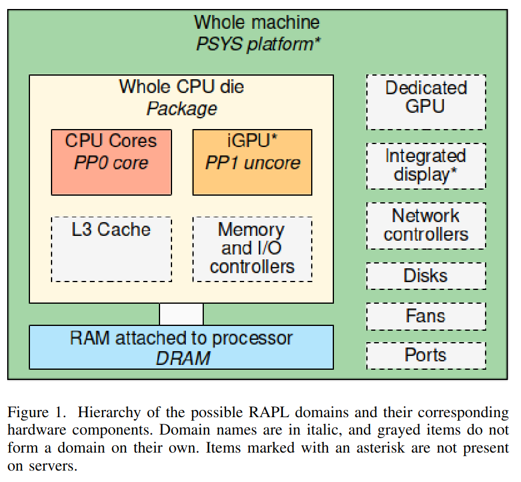

# RAPL

## Overview

RAPL (Running Average Power Limit) is an Intel processor feature that allows real-time energy consumption measurements of CPU and memory subsystem.

This technology has been available on Intel processors since *Sandy Bridge* generation.

RAPL provides energy measurements at different scales, enabling you to measure energy consumption per component and understand more precisely how each part of the system contributes to the overall power usage.

It allows fine-grained energy profiling of CPU cores, memory subsystem, and uncore components.

## Architecture

RAPL interface exposes multiple power domains that allow measuring energy consumption of different parts of the processor and memory subsystem.
Domains metrics are accessible through model-specific registers (MSRs) on the host system, enabling user to monitor power usage in real time.

### Domains

| Domain | Description |
|--------|------------|
| **Package/PKG** | Measures the total energy consumption of the entire CPU socket. This includes cores and uncore components. |
| **Core/PP0** | Represents the CPU cores only. Useful for profiling per-core energy consumption. |
| **Uncore/PP1** | Covers the energy consumption of last-level caches, memory controller, and may include the integrated GPU depending on the CPU generation. |
| **DRAM** | Measures the energy consumption of dynamic random access memory attached to the integrated memory controller if supported. |
| **PSYS** | Entire SoC energy consumption, unique (only one PSYS for the entire SoC at most, available since *Skylake* generation) |

Architecture of RAPL[^dissecting_software-based_measurement]:

### Notes

- Some of the domains may not appear depending on the processor architecture.
- The **PSYS** domain can report the same consumption as an external wattmeter[^dissecting_software-based_measurement], representing the entire computer consumption. These results, obtained on a laptop, should be interpreted with caution and could not reflect the real world.

## Should you use Powercap of perf_events ?

Powercap is a framework for controlling and limiting power while perf_events is a tool for measuring performance counters.  
Thus, their design differs from each other, perf_events uses kernel mechanisms to minimize user–kernel transitions during data collection, reducing overhead for frequent measurements, while Powercap relies on a sysfs interface, where each read or write triggers a kernel entry, making it more suitable for infrequent operations or control tasks.

While they both use the same underlying technology (e.g., **MSRs for Intel RAPL**), they operate at different abstraction layers. perf_events provides a **measurement-oriented interface** optimized for profiling, whereas Powercap provides a **control-oriented interface** suitable for setting power limits or enforcing budgets.

| Scenario | Recommended Interface | Reason |
|----------|--------------------|--------|
| High-frequency, fine-grained energy measurement | perf_events | Minimal overhead introduced and less transition from user to kernel space |
| Moderate to low-frequency | perf_events or Powercap | Syscall overhead is acceptable, perf_events requires more configuration (perf_event_paranoid), while powercap is easy to use |

**Summary:** You should always prefer to use perf_events if it is configured on your system, but powercap is turnkey and easy to use.

## Why not use MSRs ?

We can access MSRs through the filesystem at `/dev/cpu/{core}/msr`, therefore, in principle we could read RAPL counters directly from the registers to minimize overhead. 

In reality, doing so does not necessarily achieve better performance[^dissecting_software-based_measurement] than using powercap because it is already optimized for safe and efficient access. Direct MSR reads can produce noisier results due to lack of kernel-level smoothing and synchronization, whereas Powercap smoothens measurements and provides consistent, stable energy readings.

Additionally, using MSRs requires careful handling, overflow handling, is less portable, and can introduce safety and consistency issues that higher-level interfaces handle automatically.

## Limitations

- Although RAPL interface provides multiple domains enabling fine-grained energy profiling, it does not offer per-process energy attribution, making it difficult to accurately assess the energy consumption of individual processes.
- Some domains like **DRAM** or **PSYS** might not be available and the **Uncore** domain may not include the same components depending on the CPU generation, moreover, the **DRAM** domains might not be included in the **Package** domain.
- Short lived events with variations and quick workloads might not be captured due to the limited resolution of hardware counters.

[^dissecting_software-based_measurement]: G. Raffin and D. Trystram, "Dissecting the Software-Based Measurement of CPU Energy Consumption: A Comparative Analysis," in IEEE Transactions on Parallel and Distributed Systems, vol. 36, no. 1, pp. 96-107, Jan. 2025, doi: 10.1109/TPDS.2024.3492336.